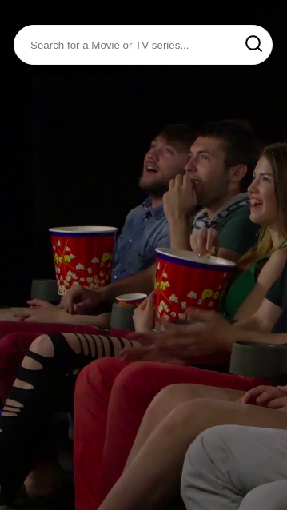
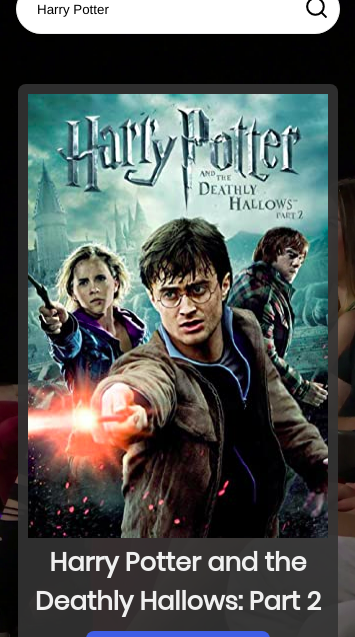
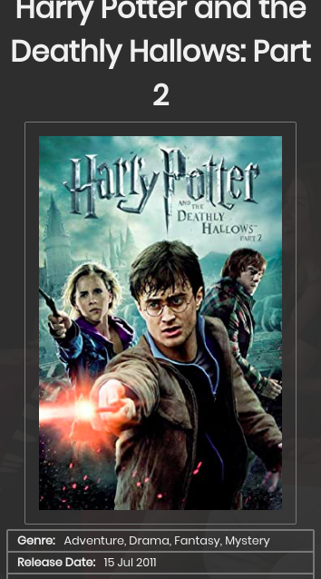
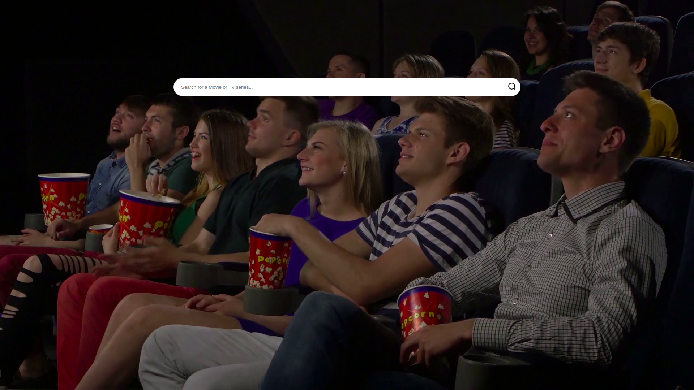
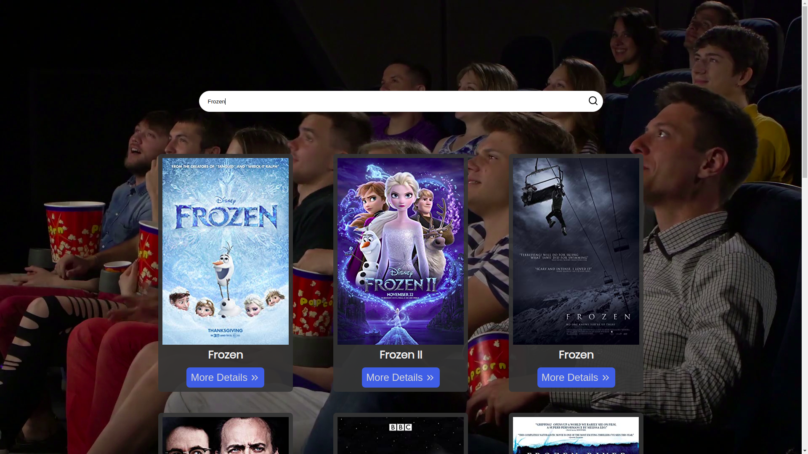
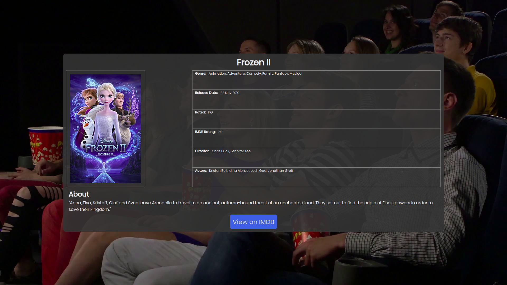

# Movie - Finder
This project is a *Movie Finder* written in [React JS](https://reactjs.org/) and using the [OMDb API](http://www.omdbapi.com/). This project is inspired in [1 - An Overview about the app & Why to use React with Redux](https://www.youtube.com/watch?v=Ia0WWc5dyLE&list=PLG3RxIUKLJlbDDGeeoUCkinS2DUybp_1o) youtube video.

## Project Status
Completed
Live version: https://figueiroaandre.github.io/movie-finder/search

## Mobile View

    
    
    

## Desktop View

## Goals
This is the first project, using react, that i'll develop alone. That's being said, the main goal of this project is practice with the React and use an external api.

## Required Features
- [x] Search bar: User can search for movies using the search bar, the page will only start the search after user hit the **Search** button.
- [x] Display movies list: After the user hit search, that application have to make a request to the api, and then return both the title and the poster of the movie.
- [x] Movie Info: If the user click on a movie in the movies list, then a page with more information of the movie will be displayed

## Lessons learned and Decisions

1. **React JS Fundamentals** - I have had the opportunity to practice the fundamentals of this incredible front-end library. My understanding of what is a component, a state, properties, etc. is so much clear than before this project.

2. **Read Documentation** - I had to read the documentations (not entirely, only the parts of my interest) of the tools that i have used in this project (api and js libraries).

3. **Use ES6+ Features** - Arrow functions, async/await, destructuring, etc.

4. **CSS Flexbox & CSS Grid** - I have not felt ,at ant moment, like i needed to use a CSS library ,like Bootstrap and others.

5. **JS Libraries** - I have to use some useful libraries like *react-router-dom*, *axios* and *react*.

6. **Folder Structure** - A organized folder/file structure helped a lot to understand the project as a whole

7. **Deploy a React APP in Githun pages** - I learned how to deploy a React App that uses React-Router-Dom into Github pages

## Future Work
1. Build an application that has a backend, using nodeJS
2. Build an application that has a database, using MySQL
3. Build an application that has tests, probably using jest
4. Commit changes more frequently (instead of commit everything at once like i did with this project)
